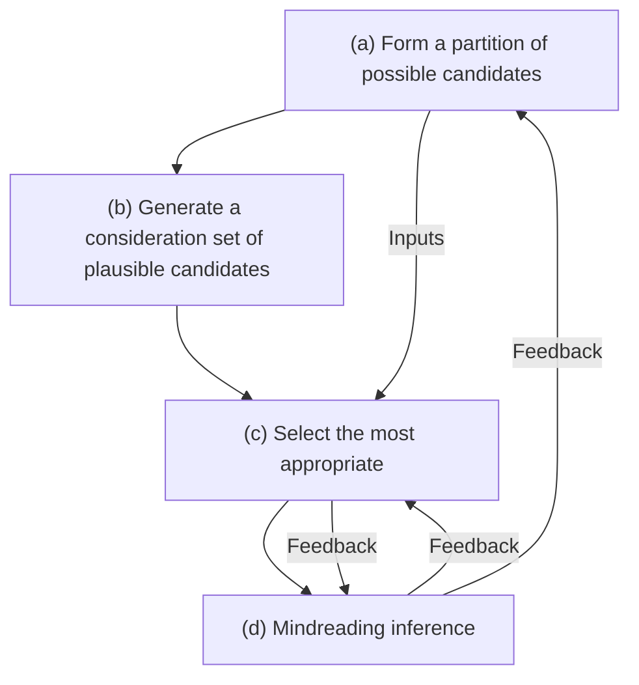
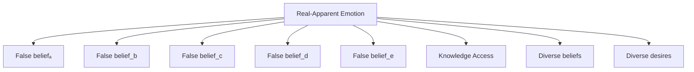

# Abstract

Research on mindreading has been dominated by questions about the presence, absence or nature of mindreading concepts or structures, and by paradigms designed to create the most favourable circumstances for demonstrating such abilities. This focus on competence has led to a neglect of questions about performance. Yet without a theory of performance, mindreading concepts and structures are incapable of explaining how we ascribe particular thoughts and feelings to other people, and it is impossible to explain individual differences in mindreading that are persistent, robust, specific, and consequential for social abilities. We reconsider the theoretical foundations of mindreading to develop an account on which competent mindreading requires generating and selecting mental states that can be recognised as plausible and appropriate by other people, and so is essentially a coordination activity. It is asynchronous coordination because, once learned, it can be performed alone. The MAC (Mindreading as Asynchronous Coordination) account explains how mindreading serves as a mediator in human social lives, is shaped by social experience, varies according to that experience, and enables social abilities that would not be the same without its mediating role. The MAC account can explain a swath of existing findings about individual differences in mindreading that are otherwise puzzling. It provides a framework for understanding how and why mindreading abilities might vary across the lifespan, and for developing interpretable and psychometrically robust measures to study this variation.

# Introduction

More than forty years after the first empirical paper testing children's false belief reasoning, research on mindreading is still viewed predominantly through the lens of early development. This focus on when such abilities first occur has consequences for both theoretical and empirical enquiry. Developmental theories tend to emphasise basic structural necessities – such as concepts of belief, desire, intention and the like (e. g., Carpendale & Lewis, 2004; Doherty & Perner, 2020; Tomasello, 2018; Wellman, 2014). Empirical studies prioritise paradigms that are sensitive to the detection of such concepts (e.g., Scott & Baillargeon, 2017). Of course, researchers have also examined how mindreading develops in ontogeny (e.g. Devine & Lecce, 2021; Gopnik & Meltzoff, 1997; Hughes, 2011; Tomasello, 2010), phylogeny (e.g., Krupenye & Call, 2019; Martin & Santos, 2016), and human history (e.g., Heyes, 2019; Moore, 2021), how it varies between individuals and groups (e.g., Hughes & Devine, 2015a; Lillard, 1998; Osterhaus & Bosacki, 2022; Yeung, 2024), and its cognitive (e.g., Apperly, 2010; Ferguson & Bradford, 2021) and neural basis (e.g., Gilead & Ochsner, 2021). However, the lens of early development means that even this research is dominated by questions about the presence, absence or nature of mindreading concepts or structures, and by paradigms designed to create the most favourable of circumstances for demonstrating such abilities. This is critically limiting for both theoretical and empirical work. Theoretically, concepts may be necessary for mindreading, but they are insufficient because it remains unclear how someone with the necessary concepts is ever in a position to use them effectively. Empirically, as we shall review below, there is increasing evidence of individual differences in mindreading that are persistent, robust, specific, and consequential, yet we lack theories or tasks that cast light on the reasons for this variation. After 40 years we still do not know how people ascribe any specific mental state, nor why some people are better at this than others. Our contention is that these basic questions are related and can only be addressed by rethinking, from the foundations up, ideas about what mindreading is and what makes it possible.

In what follows we first introduce our key ideas in outline form. Next, we develop the theoretical basis for our contention, beginning from foundations, and explore its consequences for how mindreading is conceptualised. In the second part of the paper, we show how our approach can address large gaps in current understanding of longitudinal stability in mindreading and individual differences across the lifespan. Finally we evaluate our new account in relation to existing theories.

# 1. Outline

What does it mean to “be in a position” to use mindreading concepts effectively? This is a question that we will tackle in stages, but let us start by illustrating the essential problem using by far the most widelyadopted paradigm for mindreading: false belief tasks. In one classic form of false belief task (Wimmer & Perner, 1983) Maxi places his chocolate in the blue cupboard. While he is playing outside his mother moves it to the green cupboard. Maxi returns, wanting his chocolate. The critical question is where will he look for his chocolate? Most people over the age of 4 or 5 years agree that he will look in the blue cupboard, because that is where he falsely believes his chocolate is located. But why do most people agree? Strictly speaking, Maxi could reasonably think his chocolate is elsewhere - he might have prior experience of his mother's preference for storing food in the green cupboard, he might have a prior agreement with his mother, or he might have unusual beliefs about the behaviour of physical objects. It is only the carefully-crafted pragmatic constraints of the story (and our sensitivity to those constraints) that mean we are in a position to conceive of only one possible correct answer. Such false belief tasks are an essential workhorse of empirical research on mindreading, but they also obscure the fact that the world is not subject to the kinds of pragmatic constraints that govern storytelling and does not typically come neatly curated into correct and incorrect alternatives for what people think or feel. Outside such tightly constrained tasks mindreaders must take on much more of the work of homing in on plausible mental states. Understanding how we do this is an essential and overlooked puzzle about mindreading.

Why are individual differences in mindreading informative for our purposes? Again, we will tackle this in stages. But let us first establish the intuition that there really is variation in mindreading and explain why this might be puzzling. Imagine, for a moment, your social network of adult friends, colleagues, and acquaintances. If it is anything like ours then you might perceive substantial variation in people's social skills. You may also work in an environment that is highly selective for academic ability. If your work environment is anything like ours, then you might still perceive substantial variation in social skills. That is to say, although general cognitive ability may be relevant for social skills, it is clearly not a sufficient explanation for their variation. As we will later describe, this conclusion is also borne out by empirical investigations. The puzzle is that adults, and indeed children from middle childhood onwards, tend to pass tests for key mindreading concepts and related emotion concepts (e.g., Pons et al., 2003; Pons et al., 2004; Wellman et al., 2011). There are tests of “advanced mindreading” that continue to pose varying degrees of challenge but no theory of “advanced mindreading concepts” that explains what is challenging about these tasks. Thus, the origin of individual differences in advanced mindreading is a key point of failure for existing concept-focused theories, and a key challenge for empirical research is to devise mindreading tasks that do justice to the intuition that some people appear better at this kind of thing than others.

Our starting point is a pair of questions usually treated separately, one foundational and the other empirical: (1) What constitutes successful mindreading? (2) Why are there persistent, robust, and consequential individual differences in mindreading among adult humans with no relevant differences in concept possession? Our central contention is that the answers to these questions are interdependent. Understanding what constitutes successful mindreading is essential to explain why some people are better at mindreading than others, why individual differences are stable over time, and why they matter for broader social functioning. Conversely, the patterns in individual differences inform our understanding what successful mindreading could be.

Real mindreaders face two problems: the available evidence underdetermines the ascriptions they make, and the targets of mindreading are only boundedly rational. It follows that successful mindreading cannot consist merely in accurately identifying mental states. Instead, success also requires making mental-state ascriptions that other people would recognize as plausible and appropriate.

How do mindreaders achieve this? Taking inspiration from accounts of modal reasoning, we propose that mindreading involves generating a restricted set of candidate mental states, then selecting among them. But whereas modal reasoners can satisfice using individual heuristics based on attributes such as context-free value or frequency, mindreaders rely on alignment upon background assumptions, norms and expectations, acquired through social interaction. This is asynchronous coordination: coordination because successful mindreading depends on interaction for alignment with social standards, and asynchronous because past interactions and anticipation of future evaluations enable mindreading even when alone. Past interactions align mindreaders on which ascrip tions of mental states come most readily to mind and also on the standards by which to judge better ascriptions. Even when alone, a mindreader can generate plausible candidate mental-state ascriptions and select from among them ascriptions that others, including the target of mindreading, would judge best. In this respect, our view makes mindreading performance analogous to tuning in to what counts as funny or rude within a group.

If mindreading is asynchronous coordination, we have identified sources of variance with the potential to explain individual differences. A mindreader's history of social alignment, their flexibility in applying interpretative norms, and their capacity to anticipate other groupmembers' ascriptions may all influence how successful they are at mindreading. This view leads to reinterpretation and novel predictions concerning, longitudinal stability, lifespan variation and measurement.

What follows develops this argument. We start with the foundational question about what constitutes successful mindreading.

# 2. Foundations

Comparison with linguistic communication suggests that understanding mindreading performance may be as important as understanding mindreading concepts and rules. While much can be learned from the study of words and linguistic rules, multiple additional fields of study (for example, in phonetics and pragmatics) have proved necessary for addressing how such elements of language are used for successful communication. Moreover, the study of children's acquisition of linguistic competence (e.g., Bavin & Naigles, 2015) requires theories and methods that are distinct from those used to study adults' linguistic performance (e.g., Traxler & Gernsbacher, 2011). Likewise, understanding mindreading performance may require fundamentally new ideas. To understand performance, we need an account of successful mindreading.

It is commonly supposed that when we mindread, success consists in identifying facts about mental states as accurately as possible. Framed this way, one starts with an agent whose head is full of beliefs, desires, and intentions that interact to cause the agent's behaviour. These mental states cannot be observed directly, and so the mindreader's job is to infer what they might be from the agent's behaviour. Success is determined by identifying as accurately as possible which mental states the agent in fact has. To many readers this will seem so obviously true that it does not need stating, and this supposition is the foundation for most psychological research on mindreading. But one need not look far for a contrary view. Dennett's (1988) “intentional stance” theory is widely cited in empirical research on mindreading. Yet in Dennett's framing mental states are ascribed as an interpretive gloss over a set of behaviours with no commitment to their neurocognitive basis in the head of the target. If behaviour is predicted successfully then the mental-state ascriptions are accurate. The sense in which agents “have” mental states is fundamentally different in this framing because the facts about mental states are determined by whether mindreading succeeds or fails (and not the other way around).

While Dennett focussed on successful prediction of behaviour as the standard of success for mindreading, others have proposed widening the standard to include success in attributing responsibility, making sense of behaviours, and modulating behaviours or ‘mindshaping’ (e.g., Zawidzki, 2013). In what follows we offer a partial defence of these insights and build on them to offer a refinement: in practice, successful mindreading requires generating and selecting mental states that can be recognised as plausible and appropriate by other people.

This view of successful mindreading can also be supported by starting from a theory opposed to Dennett's on which facts about mental states do determine whether mindreading is successful, namely Davidson's (1973, 1985, 1990) extensively developed account.1 Inspired by the success of decision theory, and specifically by the possibility of treating decision theory as an elucidation of what preferences are (Jeffrey, 1983),2 Davidson pointed to a set of normative requirements which specify a structure to which, he claimed, any mindreading target's mental states must conform (Davidson, 1980, 7, 12).3 To illustrate, one requirement is that the target's beliefs be logically consistent; another is that the target and the mindreader agree about which observations provide evidential support for which conclusion. Davidson demonstrated that this structure makes it possible, in principle, to discover a person's mind through observation and communication.4 Davidson's theory also entails a clear view about what makes for better or worse mindreading. Just as there are facts about an object's weight or temperature, so also there are facts about a person's mental states; and better mindreading is more accurately identifying those mental states.5

But is this view true? Davidson's theory was never supposed to be an account of how people actually read others' minds (Davidson, 1990),6 but by articulating the requirements-in-principle for accurate identification of mental states it illuminates some challenges of mindreading in practice. As we will see (in the section on Formal Models), these challenges also arise for theories that attempt to describe how people actually read others' minds (e.g., Baker et al., 2017). Attention to the challenges will lead us to a different view about what makes for better mindreading.

The first challenge is the problem of infinite observations. Davidson's theory requires observations of ‘a potential infinity’ of actions to identify any mental states at all (Davidson, 1990, 314). In order to ascribe to Maxi the belief that the chocolate is in the blue cupboard the mindreader would need to observe all the possible consequences of that belief. Without doing so it is impossible to exclude the potential infinity of variously similar but non-identical beliefs (e.g., that he thinks the chocolate is in the blue cupboard every day except Thursdays). By contrast, practical mindreading involves not merely finite, but often very few observations. How can mindreaders coherently attribute any mental states based on few observations? However they do this, it will amount to selecting one or another set of background assumptions to fill in the missing observations imaginatively. Which background assumptions should be adopted? There are indefinitely many possible background assumptions which could be used to fill in missing observations. We have already illustrated this in the case of Maxi: when asked about his actions or beliefs, most people implicitly assume that Maxi shares their beliefs about the ways physical objects behave, that he has no expectations about his chocolate moving while absent, and so on. These implicit assumptions fill in for missing observations. But there are, of course, other assumptions people could make which would lead them to predict different actions and to attribute different mental states to Maxi. And these alternative assumptions would not necessarily be wrong. A group of people might rely on different implicit assumptions (e.g., that Maxi has expectations that the chocolate has moved), and in many cases there would be no logical or rational grounds to criticise them. The most we can say is that there is likely to be an advantage in making roughly the same background assumptions as other people with whom you might seek agreement. Critically, this includes Maxi.

This matters for understanding what skilled mindreading performance is. Having the right concepts and rules is not sufficient. Practical considerations will be needed in selecting background assumptions to fill in missing observations. Whether particular background assumptions are good may depend on a mindreader's aims: what works well for prediction may work less well when the aim is to assign blame or to challenge another person's self-understanding. Given the value of agreement with others on which mental states a person has, whether particular background assumptions are good may also depend on which assumptions other mindreaders will make. One consequence is that better mindreading is not simply a matter of more accurately identifying mental states because in any practical scenario objective criteria for accuracy available to mindreaders are not sufficient to determine mental-state ascriptions. Another consequence is that better mindreaders may be more flexible in shifting background assumptions between contexts, more willing to consider a wider range of possible mental states when confidence in background assumptions is lower, and better at aligning background assumptions with others. In short, they will be good at generating plausible background assumptions and at selecting the most appropriate from among them.

One might attempt to respond to this challenge by suggesting that mindreading need not involve infinite observations at all because it can be anchored in platitudes (Lewis, 1972). To illustrate, one platitude is that being told something entails knowing it. If Maxi is told that his chocolate is in the green cupboard, then we might infer that Maxi knows his chocolate is in the green cupboard. Such platitudes are surely useful in mindreading (Heider, 1958), but we will overestimate their usefulness if we ignore context. Perhaps the speaker has deceptive motives, or is joking, or simply being sarcastic. Perhaps Maxi does not hear or correctly process the message. An indefinite range of contextual factors can render the platitude incorrect. An appeal to platitudes appears to solve the problem of infinite observations only if we ignore the role of context in mindreading.

The problem of irrationality is the second challenge in applying Davidson's theory in practical mindreading. Similarly to decision theory, Davidson's theory applies only on condition that people are ideally rational (and, perhaps even less plausibly, mostly truthful). This condition requires not just flawless inferences: Maxi's every belief, desire and intention must at all times bear in exactly the right way on his actions.7 Failure of this condition would lead to the conclusion that no humans, nor any other finite animals, have any mental states at all and our bounded rationality implies, of course, that this condition does fail.8 A model of how people attribute mental states must allow that people are rational only within limits. Davidson suggested that his theory can be saved only by adopting the formal device that it should apply to parts of people's minds within which the rationality assumption could hold.9 While other strategies are conceivable (for example, practical mindreaders will simply ignore some of the things people do), any strategy involves deciding where exactly to hold on to a rationality assumption. To illustrate, if Maxi's preferences fail to exhibit transitivity we might select between different possibilities about which are his ‘true’ preferences and which decision reflects a ‘mistake’. This selection cannot, of course, be made on the basis of what is rational. What makes for better or worse selections will depend on practical considerations like the mindreader's culture, as there are likely to be advantages in agreeing with others around us on which mental states someone has. This is a second reason why we cannot think of better mindreading as simply being more accurate in identifying mental states. Because there are many ways you could compensate for irrationality, there are many ascriptions of mental states which will all fit the evidence equally well. But in practice, people around you are unlikely to recognize you as a competent mindreader unless you agree with them about what Maxi's mental states are, and the ability to agree with them is what underwrites mindreading's utility, even when mindreading alone.

To conclude this section, the problems of infinite observations and irrationality complement each other as one concerns a limit on mindreaders (they are finite) and the other a limit on the mindreader's targets (they are imperfectly rational). Both problems motivate rejecting the otherwise attractively simple idea that better mindreading is merely a matter of more accurately identifying mental states.10 Instead, we must recognize that, in practice, using mindreading concepts effectively involves identifying assumptions that are plausible and selecting those that are appropriate in a given context. What makes assumptions plausible and appropriate is not something internal to mindreading but is a consequence of what seems plausible and appropriate to people, who of course include both mindreaders and mindreading targets. In this respect, mindreading is not entirely unlike public gift-giving. Success requires other people being disposed to recognize that the gift (or mental-state ascription) was appropriate. Ultimately, then, an individual is successful at mindreading if they ascribe states, predict behaviours, assign responsibility, and so on in just the way that would occur if they were involved in a joint mindreading activity with others around them.

# 3. Developing the theory

As described in the Outline section, concepts and rules are unlikely to be sufficient for mindreading because there may be multiple plausible responses even in simple cases. For example, even carefully crafted false belief tasks appear to require intuitions, and confidence in them, which go well beyond anything established by mental state concepts, general principles for their application, and the evidence available in this particular situation.

To see the extent of this challenge we need a richer example than classic false belief tasks, and so we start by developing the problem of mindreading other people's thoughts and feelings through the example of gift-giving. Tulip, the head of department, is delighted with the tickets to the opera that her staff bought for her 50th birthday. When Bruno, Tulip's secretary, was tasked with organising the gift a few ideas had sprung to mind, though on reflection some seemed better than others. Although Tulip isn't known as an opera buff, it felt like the kind of thing she would like, and her partner confirmed that she didn't already have tickets. Moreover, it's the kind of thing she would be happy for everyone to know that she likes. Bruno was confident Tulip would have liked a wine-tasting class even more, but highlighting her liking for alcohol felt potentially awkward, especially in an office where some colleagues do not drink.

This example illustrates that beneath the surface of the everyday activity of gift-giving lies considerable complexity. Success requires abductive “best guesses” about potentially appropriate gifts, which take account of the characteristics of the recipient and their context. Selection among these possibilities that present themselves involves consideration of reasonableness, normativity, and reflexive awareness of others, as well as accommodating particular facts (such as whether the recipient already has the present). In short, selecting a gift draws upon a rich web of information, sources of structure, and constraint, it is essentially relational (involving the giver, the receiver, and audience), and reaches both forwards and backwards in time to take account of relevant history and anticipate future consequences. From everyday experience we might add that it is also something that some people seem distinctly better at than others.

Our contention is that gift-giving illustrates key challenges inherent in many instances of mindreading. In common with longstanding views, mindreading involves the generation and selection of candidate thoughts or feelings for the target. In contrast with most existing views, it suggests that the success of mindreading should be judged by the extent to which it accords with “what people would think” is plausible and appropriate. It even implies that someone mindreading alone is nevertheless attempting to reason from the perspective of a group of people, which is a form of collective reasoning (e.g., Bacharach, 2006; Chater et al., 2022; Schelling, 1960). In what follows we aim to show that these insights motivate a new theory, assimilate a wide range of disparate empirical evidence, and generate productive directions for new research on how social understanding varies between individuals and between groups.

# 3.1. An analogy with modal thinking

The challenge of generating useful answers from a large and illdefined problem space is by no means limited to mindreading. For example, Phillips et al. (2019) addressed the puzzle of “what comes to mind” during modal thinking about what is possible, but potentially not actual. This raises a widely-recognised set of challenges about identifying what is relevant in problem spaces that are very large or only imprecisely specified (e.g., Fodor, 2001; Sperber & Wilson, 1987). While these challenges are sometimes thought to be intractable in principle, Phillips et al. (2019) identify ways in which people proceed in practice.

Phillips et al. (2021) note consensus in the literature “that we generate the ‘alternative possibilities' fundamental to modal cognition by (i) delimiting a task-relevant partition within the vast space of conceivable possibilities, (ii) considering a smaller subset of particular possibilities within the relevant part of that partition, and then (iii)11 ordering or evaluating them in task-relevant ways to inform our final modal judgements” (p1027). For example, faced with the task of identifying something for dinner after a disabling trip to the dentist (e.g., Morris et al., 2021), people might (i) form a task-relevant partition of “dishes” (ruling out the much larger set of all inedible things, and things that are edible but not dishes), (ii) generate a smaller “consideration set” of possibilities based upon heuristics including context-free value and frequency, (iii) select from the consideration set a dish that avoids elements that are hard or crunchy and therefore unsuitable after a disabling trip to the dentist. We believe the challenge of generating and selecting possibilities in modal thinking is a model for the challenge of generating and selecting mental-state ascriptions in mindreading, but also that mindreading requires distinctive solutions to these challenges that are enlightening about how mindreading is possible and why it might vary between people.

# 3.2. Mapping the analogy to mindreading

It is often assumed that, for someone with the right concepts and rules, mindreading is a matter of inferring from observed behaviour what people think, feel and intend, much as you might infer from texture and rise what is happening inside a loaf. As noted in Foundations, making such inferences in mindreading would require choosing which of indefinitely many possible background assumptions to make and selecting one among many possible ways of repairing irrationality. The range of possible background assumptions and repair strategies therefore generates a puzzle: How are we so remarkably good at having clear intuitions about what someone else is thinking, feeling, or intending, with high confidence and in agreement with others? Any adequate account of mindreading must explain how these difficulties are overcome. In an analogous way to modal thinking we propose that having such intuitions depends on (i) “partitioning” with rule-based constraints, (ii) generating a “consideration set” of plausible possibilities by narrowing down the possible range of thoughts, feelings, or intentions another is having, and (iii) selecting the most appropriate answer from the consideration set.

# 3.2.1. Partitioning

Mindreading affords many opportunities for using rules to partition the indefinitely large space of possible mental states. For example, since Anna Karenina was both written and set in late 19th century Russia, Anna could never have views about such things as global warming or smartphones, or anything else that was not known at the time. Equally, Steve Jobs' koumpounophobia provides a rule-based limit on the space of possible desires that could be ascribed to him. However, while partitioning in this way clearly reduces the possibilities, as for modal reasoning, the space of possible answers will often remain large, leaving a major challenge for steps (ii) and (iii), which cannot be addressed using rules.

# 3.2.2. A consideration set of plausible possibilities

Step two in the model of modal reasoning uses heuristics to generate a consideration set of plausible possibilities. The heuristic attributes include ‘cached’ or context-free value (generate options that have generally proven good in the past) and, to a lesser extent, frequency or availability (generate options that have frequently arisen or come to mind easily). These heuristics are unlikely to be helpful for mindreading because they are insensitive to context and reflect only the person's individual interests and experiences. What is needed is some heuristic basis on which “what comes to mind” could be conditional on context and the collective interests and experiences of people, not individuals.

To address this, we take inspiration from analysis of related challenges that arise when people interact for communicating and acting together. An influential suggestion is that interacting people address these challenges by aligning their actions, and the mental representations and neural processes that govern them. For example, during a discourse, participants make rapid decisions about the linguistic forms they are hearing and producing, based on perceptual input that only partially constrains choices. Many accounts suggest that participants solve this problem through alignment. Over conversational turns, discourse participants converge in their phonology, word selection, syntax, and meaning representations (e.g., Gallotti & Frith, 2013; Pickering & Garrod, 2004). So, although on a given turn a speaker might have used many possible linguistic forms to express their meaning, they are more likely to repeat ones that have already featured in the discourse. These alignments simplify the tasks of communicators, by making the same (aligned) representations more available than logically possible alternatives.12 Importantly, interactive alignment does not entail mindreading, or other inferential processes, but is thought instead to depend upon “low-level” priming mechanisms at multiple levels of processing (e.g., Pickering & Garrod, 2004).

Such alignments have been studied at timescales from milliseconds to minutes, focussing on temporary alignments between participants in a discrete interaction that are dispensed with at the end of the interaction. These are the wrong properties for our purposes. Firstly, it is unlikely that alignment achieved in a single interaction would be sufficient to bridge the gap between generic information from scripts and schemas and the ascription of highly specific thoughts and feelings. Secondly, temporary interactive alignment cannot, by definition, support mindreading outside interactions, yet such mindreading is commonplace. These limitations could be addressed with a relatively modest extension of theories of interactive alignment. Research on discourse processing finds that comprehension influences different memory systems over different timescales, with some effects only operating within the limited bounds of short-term memory and others drawing upon and influencing long-term memory (e.g., Rayner et al., 2012). It is a small step to suppose that alignment, too, develops beyond specific interactions, creating longer-term, asynchronous alignment. Such alignment means that in situations where collective reasoning is relevant, individuals are primed, in a context-sensitive manner, to think similar things in similar ways.

In sum, Morris et al. (2021) suggest that responses “come to mind” for modal reasoning according to their frequency and “cached value” derived from the reasoner's experience. We suggest that responses “come to mind” for mindreading according to their salience derived from the mindreader's past interactive alignment. We propose that such asynchronous alignment is critical for explaining how people are in a position to generate plausible candidates for what another person might be thinking or feeling.

# 3.2.3. Selecting an appropriate answer from the consideration set of plausible mental states

Models of modal reasoning commonly propose that plausible candidate responses are evaluated according to task-specific constraints (such as needing to avoid hard or crunchy food) to select a response (Phillips et al., 2021). For mindreading the example of gift-buying illustrates the considerations that guide the selection of an appropriate thought or feeling. These include normative rules about what is morally and socially appropriate, and whether the ascription seems reasonable in light of other things we know about what the person thinks, wants and feels, and other aspects of their situation, time, or circumstances. Considerations are at least sometimes reflexive, such that what I think someone else will want should depend, in part, on their knowing that I or others might find out.

Importantly, such consideration of “appropriateness” is essentially social. Practically speaking, ascribing a most appropriate possible mental state is ascribing one that a group of people (including the mindreader and the target of the mental-state ascription) might also ascribe, given sufficient time to discuss it. This is why an important determiner of mindreading success will be shared criteria of appropriateness, shared norms and therefore shared background and experience with the targets of mindreading and everyone else involved.

# 3.3. Conclusion: mindreading is asynchronous coordination (MAC)

Modal reasoning and mindreading are analogous because both involve reasoning in problem spaces that are very large or only imprecisely specified. However, mindreading differs critically from modal reasoning because its criteria for success are often social and cannot be satisficed with individualistic heuristics such as value-to-self. Mindreading involves partitioning, generation of plausible candidate thoughts and feelings for the mindreading target, and selection of the most appropriate from among this set. Mindreading is “asynchronous” insofar as the criteria of plausibility and appropriateness depend upon a background of experience that exists prior to the current mindreading episode. This is true whether the mindreader is a participant or a spectator in a current social interaction, or if they are alone in the dark trying to imagine why their friend has not called, or whether Tolstoy was consistent in his depiction of Karenin's indifference to his wife's mental life. Mindreading is nevertheless a form of coordination (e.g., Bacharach, 2006; Chater et al., 2022; Schelling, 1960) because the criteria of plausibility and appropriateness are essentially joint criteria. These criteria are not merely socially learned. In practical mindreading, the criteria are the intuitions and principles with which groups of mindreaders will tend to agree, and to which individuals hold themselves in order to be considered rational and reasonable Fig. 1

# 4. Applying the theory to the challenge of understanding individual differences in mindreading

Individual differences are central to Mindreading as Asynchronous Coordination in two ways. First, patterns in individual differences complement the theoretical arguments (see ‘Foundations’) by providing empirical motivation for the account. Second, the account aims to explain existing findings on individual differences and to generate new predictions. In this section we support both points. We review core findings from recent research and highlight two important phenomena: longitudinal stability, whereby individual differences in mindreading in early childhood are stable over time and predict later social abilities; and the persistence of individual differences in mindreading across the lifespan. In each case we identify a surprising failure of existing theories to explain how such individual differences are possible, and we examine how the MAC account can help.

# 4.1. Core methods and phenomena in children

Measurement of individual differences requires mindreading tasks on which performance will vary reliably in a given age range. Tasks originally devised to test for young children's possession of mindreading concepts can often be aggregated into batteries that provide reliable measures of individual differences in young children. For example, individual differences in performance on false-belief task batteries are psychometrically robust: they are explained by a single latent factor (e. $g _ { \cdot , }$ Hughes et al., 2018), show test-retest reliability $( \boldsymbol { \mathrm { e . } } \boldsymbol { \mathrm { g . } } ,$ Hughes et al., 2000), and exhibit rank-order stability over time (e.g., Devine & Hughes, 2019). They are consequential in that they predict later social adjustment (e.g., Lecce & Devine, 2021). Unsurprisingly, since false belief tasks were devised to be sensitive tests of young children's concept possession, these tasks also demonstrate ceiling effects beyond age 6. To overcome ceiling effects researchers have devised “advanced” mindreading tasks that involve more subtle or complicated uses of beliefs, desires, and intentions. For example, the Strange Stories task (White et al., 2009; Happ´e, 1994) presents children with short stories and the Silent Film task (Devine & Hughes, 2013) presents children with short film excerpts, and tests their understanding of the depicted social scenarios that might involve misunderstandings, lies, and double-bluffs. The correct answer is an interpretation determined by the researchers' own judgement, by the majority view of a reference sample of participants, or some combination of these criteria (Yeung et al., 2023. Advanced tasks successfully raise the ceiling for performance and measure reliable variance into adolescence (Devine et al., 2023).

Advanced tasks are not only harder. Numerous studies have demonstrated clear gains in mindreading performance across middle childhood and adolescence (e.g., Devine & Hughes, 2013; Dumontheil et al., 2010; Meinhardt-Injac et al., 2020; Osterhaus et al., 2016). These gains are difficult to explain in terms of “new mindreading concepts” but nonetheless appear specifically social because they are not explained by improved performance in language ability or executive function (e.g., Devine & Hughes, 2016; Lecce et al., 2017). So even if the rate of concept acquisition contributes to explaining earlier developmental differences, the gains in middle childhood appear to require a different explanation.

Alongside evidence of continued growth in mindreading performance, there are marked individual differences in performance even within narrow age ranges (e.g., Devine et al., 2023). Rank-order stability in mindreading performance on a given task challenges the idea that individual differences in performance simply capture temporary differences in children's mastery of mental concepts or differences arising from task performance factors $( \boldsymbol { \mathrm { e } } . \boldsymbol { \mathrm { g } } . ,$ , Hughes & Devine, 2015b). Instead, measures like the false belief task appear to provide an early marker of persistent individual differences in mindreading, measured within a narrow window of sensitivity for a given task (Devine, 2021). Moreover, individual differences in performance exhibit longitudinal stability over time (e.g., Banerjee et al., 2011; Lecce et al., 2024). In a meta-analysis of 76 longitudinal studies in children, Devine (2021) found moderate-tostrong rank-order stability in in ToM across childhood $( r = 0 . 4 0 )$ , on a variety of tasks, comparable to the stability of general intelligence in early childhood (Tucker-Drob & Briley, 2014). Longitudinal rank-order stability in performance across different measures appropriate for different ages (i.e. heterotypic stability) suggests that different mindreading tasks might tap into individual differences in the same underlying trait at different points in development (e.g., Devine et al., 2016).

Individual differences in mindreading are consequential because they are linked with meaningful social outcomes. For example, overand-above language ability, executive function and social motivation, individual differences in mindreading in middle childhood and adolescence are associated with superior social skills (e.g., Ronchi et al., 2020; Devine & Apperly, 2022; Tamnes et al., 2018). Furthermore, in line with evidence from early childhood about the influence of social experience on young children's mindreading (e.g., Devine & Hughes, 2018), children in classrooms where teachers frequently use mental state language perform better on tests of mindreading than other children (Lecce et al., 2022).

In summary, there are individual differences in a single latent factor for mindreading from early childhood to adolescence that are persistent, robust, specific, and consequential. It is important to note that evidence of a single latent factor does not imply that mindreading must be a unitary process or a single developmental achievement. For example, there are good reasons to believe that children's understanding of different mental states and emotions develops gradually (e.g., Wellman & Liu, 2004; Wellman et al., 2011; see also Pons et al., 2003), and the ability to think about a single mental state occurs earlier than understanding how mental states behave recursively (e.g., beliefs about beliefs, Perner & Wimmer, 1985) or interact with one another (e.g., belief-based emotions, Pons et al., 2003). What the existence of a single latent factor implies is that there is nevertheless a common source of variance across different tasks involving different mental concepts, 13 and across developmental time. It is this stable common variance that we seek to explain.

flowchart

Fig. 1. Schematic model of the process of generation and selection of mindreading inferences. (a) Rule-based constraints form a partition of possible mental states (blue) from the field of all possible mental states (grey). (b) Plausible candidates are generated by integrating inputs about the target and context with background information that has been structured through interactive social experience. Variation in plausibility is represented by the height of the blue bars. (c) The most appropriate candidate(s) is selected by integrating inputs about the target and context with considerations of normativity, morality, and reasonableness derived from prior social experience. The selected mental state (red bar) may not have been the most plausible at step (b). The selections may become additional inputs to the generation process (d), resulting in further cycles of generation and selection. This ultimately leads to an appropriate candidate being selected as the mindreading inference (e). (For interpretation of the references to colour in this figure legend, the reader is referred to the web version of this article.)

# 4.2. Explaining longitudinal stability

No existing account can adequately explain evidence that individual

differences in mindreading are stable over time. Accounts that focus on the structures and concepts necessary for mindreading (see Comparison With Other Accounts) fail to explain longitudinal stability because mindreading concepts and structures are thought to be universally acquired by late childhood. If all children acquire the same concepts and structures for mindreading then concepts and structures cannot explain why mindreading ability continues to vary, or why variance predicts later social ability. What is needed is an account on which developmental differences in concept possession may diminish with age even while stable individual differences persist in the use of those concepts for mindreading.

Accounts that focus on differences in processing capacity or social motivation have the potential, in principle, to explain why some children may be faster than others to pass mindreading tasks, and why differences in mindreading are persistent over time. However, they are insufficient. Variation in earlier mindreading predicts later mindreading and social outcomes over and above performance on measures of executive function and language ability (e.g., Devine et al., 2016). Likewise, recent work suggests social motivation only partially accounts for individual differences in mindreading and social ability (Devine & Apperly, 2022).

The Mindreading as Asynchronous Coordination (MAC) account shows how the effective use of mindreading can continue to vary over developmental time, and over and above effects of processing capacity and social motivation. This means that it can be a mediator, that continues to be affected by social experience, social motivation, and other influences, leading to unique new influences on social ability.

# 4.3. New predictions

Providing a viable explanation of longitudinal stability yields new and distinctive predictions regarding the measurement of early mindreading abilities. One common practice is to measure early mindreading according to a “scale” ranging from early-acquired to later-acquired concepts. This accords well with conceptual accounts, and as demonstrated by Wellman and colleagues (e.g., Wellman & Liu, 2004; Wellman et al., 2011; see also Pons et al., 2003, for related evidence in relation to emotions), scales of this kind not only show an age-related increase in the number of concepts present, but also a reliable order of emergence, at least within a given culture. A second common practice measures individual differences on batteries of different instantiations of the same task (most often false belief tasks) within a sensitive age range (e.g., Hughes & Devine, 2015a). This accords poorly with conceptual accounts, which have no basis for interpreting degrees of performance on tasks designed to operationalise the same concept (Apperly, 2012), yet as reviewed above, performance on such batteries shows stable and meaningful variability. Whereas these two measurement approaches are often used interchangeably, we propose that variation on such measures should instead be conceptualised on two orthogonal dimensions (see Fig. 2). The vertical dimension corresponds to the number of mental state concepts that a child appears to understand at a given point in time. The horizontal dimension corresponds to the number of contexts (operationalised as the number of tasks) in which a child can demonstrate appropriate use of a given concept. To the extent that mindreading is a mediator and not merely an enabler of later abilities, a child's score on the horizontal dimension should be a better predictor of later mindreading and later social ability, compared with their score on the vertical dimension. (See Fig. 2.)

The MAC account also yields distinctive new predictions about the influence of social experience on mindreading by distinguishing between generation of plausible mental states versus selection of the most appropriate from among them. The account suggests that children's exposure to rich social and communicative interactions in which they become aligned with others will influence their ability to generate plausible possibilities when required to imagine what someone else is thinking or feeling (c.f. Ensor & Hughes, 2008; Meins et al., 2003). It also suggests that children's participation in joint folk psychological activities (e.g., negotiating how mental states feature in reason-giving explanations about other people and oneself - see Social Construction below) will be a particular influence on their ability to select the most appropriate mental state from among plausible possibilities.

In summary, the MAC account has the right form to explain longitudinal stability, is readily compatible with evidence of social effects on mindreading over and above cognitive effects and leads to novel predictions and recommendations for improved methods for future work.

# 4.4. Core phenomena and methods in adults

Most research on mindreading in adults has adopted an experimental approach to address questions about cognitive and neural processes. This work has provided evidence for aspects of mindreading that are more or less automatic, for distinguishing processing steps involved in inferences about mental states, storing such information, and using the information to guide responses, for distinct neural substrates involved in inferring mental states versus controlling interference between the perspectives of self and other, and for memory and executive processes supporting these processes (e.g., Apperly, 2010; Frith & Frith, 2012; Gilead & Ochsner, 2021; Happ´e et al., 2017). Importantly, the existence of multiple component processes for mindreading does not entail an equal number of sources of individual differences. Indeed, in principle it is possible that just one of these processes is the limiting step that determines the level of individual performance in normal circumstances (e. g., Apperly & Wang, 2021), even if things are more complex in practice.

In a recent systematic review Yeung et al., 2023 argued that current evidence on mindreading in adults falls short of meeting strong criteria for reliable and valid measurement, in contrast to better quality evidence from the developmental literature. Across 273 studies that used 75 different measures of mindreading with adults Yeung et al. found that mindreading tasks often failed to correlate with one another. While this could reflect distinct variance arising from distinct processes, this conclusion was not strongly supported because unreliable measurement (e.g. due to ceiling effects, low statistical power, or simply the absence of reliability tests) typically provided an alternative explanation.

Nevertheless, a series of adequately powered studies has recently demonstrated reliable measurement and reliable relationships between several existing and novel measures of mindreading in adult participants (e.g., Lee et al., 2025; Pomareda et al., 2024a, 2024b). We proceed on the assumption that at least one source of meaningful individual differences in mindreading persists beyond adolescence, and therefore has the potential to explain persistent individual differences in adults' social ability.

# 4.5. Explaining Lifespan individual differences

Since tests of core mindreading concepts are passed during childhood, adolescents and adults cannot be expected to vary in their possession of core concepts. It has been suggested that adolescents and adults continue to acquire more subtle or sophisticated mindreading concepts, which may not reach a ceiling of sophistication in all adults (e. g., Wellman, 2014).14 However, no theory describing advanced mindreading concepts has yet been articulated (e.g., Osterhaus & Bosacki, 2022), and it is unclear what new concepts are required for success on existing “advanced” mindreading tasks.15 At most such tasks typically involve the combination or recursion of core concepts (e.g., an intention thwarted by ignorance; beliefs about beliefs), suggesting that they may require greater processing capacity but not new concepts(Dziobek et al., 2006; White et al., 2009). Thus research on advanced mindreading points to the same conclusion as our earlier survey of developmental research: New mindreading concepts do not seem necessary to explain

flowchart

Fig. 2. Visualisation of variation in early mindreading on two orthogonal dimensions. The vertical dimension corresponds to the number of concepts currently in a child's repertoire (cf. Wellman & Liu, 2004). The horizontal dimension corresponds to flexible exercise of a given concept across different contexts (False belief a-e). For clarity the latter is illustrated only for the example of false beliefs, but of course any concept can be tested across multiple contexts, as illustrated by the range of tasks that target each concept in the existing literature.

<table><tr><td></td><td rowspan="2">No context</td><td rowspan="2">Prime Response (a):They are meeting because his daughter called him.</td><td rowspan="2">Prime Response (b):He just invited his daughter out to tell her his decision to divorce her mother.</td></tr><tr><td>Response options</td></tr><tr><td>(a) He is focused on what she is saying.</td><td>60%</td><td>65%</td><td>20%</td></tr><tr><td>(b) He is worried about the news he is about to pass on.</td><td>20%</td><td>20%</td><td>80%</td></tr><tr><td>(c) He is angry and annoyed about her attitude.</td><td>5%</td><td>10%</td><td>0%</td></tr><tr><td>(d) He is feeling disappointed with his daughter.</td><td>15%</td><td>5%</td><td>0%</td></tr></table>

Fig. 3. Example stimuli and illustrative data from Yeung (2024), study 5d. Twenty adult participants per condition judged the response option that best fit the picture. Participants were either given no further context, or prime sentence intended to bias them towards response (a) or (b). Data presented here are from a “young” adult sample aged 18–25. A further study found that these patterns differed in younger versus older adults (aged 53–60). Whereas younger adults' spontaneous interpretations were most often consistent with option (a), older adults' interpretations were more often consistent with option (c). A person who was sensitive to such variation would be a more capable mindreader.

lifespan individual differences in mindreading, nor are they likely to be sufficient.

Evidence from neuropsychology, dual-task interference, and brain stimulation suggests that adults' successful mindreading depends upon possessing the necessary capacity for working memory and cognitive control (e.g., Apperly, 2010; Frith & Frith, 2012; Gilead & Ochsner, 2021; Happ´e et al., 2017). However, correlations between mindreading performance and tests of working memory and cognitive control are typically modest and are observed inconsistently (e.g., Qureshi et al., 2020; Ryskin et al., 2015), suggesting that these capacities, while necessary, are not critically limiting for many adults on many tasks. A potential exception is highly recursive mindreading, which plausibly makes considerable demands on working memory. However, recent evidence suggests that previous work has significantly overestimated adults' recursive mindreading capacity (Wilson et al., 2023), meaning that it is unlikely to be a major source of individual differences. Overall, this limited role for processing capacity in explaining individual

differences accords with the intuition that general cognitive ability is relevant but insufficient to explain variation in social ability.

Finally, it is plausible that variation in social motivation contributes to variation in mindreading (e.g., Contreras-Huerta et al., 2020; Pomareda et al., 2024a). However, without an account of how mindreading can vary in adults, there is no way of explaining how it could be affected by variation in social motivation.

In sum, the current literature has made little progress beyond the unsatisfactory conclusion that adults who score higher on tests of mindreading are demonstrating greater mindreading abilities. The MAC account addresses this challenge by providing criteria for judging the quality of mindreading.

# 4.6. What counts as a “good” mindreading answer?

According to the MAC account, the mark of good mindreading is agreement with others around us, including, but not only, the target of mindreading. To a first approximation, an interpretation is treated as correct just if it is what a group of people would jointly conclude given adequate time to discuss it. Discussion establishes consensus on relevant information about the target and their situation, airs potential interpretations, and supports the selection of the best interpretation in light of moral and normative rules, context, and considerations of “reasonableness”. By the end all discussants should acknowledge the quality of the agreed-upon interpretation, even if it was not the one they would have reached independently. It follows that a good mindreader is someone who can simulate the results of such a group process.16 As described earlier, the MAC account suggests that such simulation is dependent upon prior experience of interactive alignment that equips the mindreader with the intuitions to generate a plausible set of candidate mental states, and the shared norms and principles used to select an appropriate mental state from that set.

The first approximation assumes that both the group of mindreaders and the mindreading target are drawn from a similar population, so that it is possible to establish consensus on what information is relevant, what interpretations are plausible, and which is most appropriate. However, it is clearly possible that differences in knowledge, judgements of relevance, and what is moral, reasonable, or normatively correct, could result in groups with different compositions coming to different agreements, or to those agreements being invalid for the target. It follows that a mindreader who is flexible enough to simulate the interpretations of a range of groups and targets will be more successful than one who cannot. With these conclusions it is possible to address the challenge of measuring individual differences in mindreading. We will use examples of recent studies from our own research to illustrate how the MAC account leads to new research questions and approaches.

# 4.7. Measurement of individual differences across the lifespan: mindreading interpretations

# 4.7.1. Mindreading interpretations are variable

The MAC account predicts that there may sometimes be more than one acceptable mindreading interpretation, that acceptability may vary by context, and that different groups of people may agree on different interpretations. In recent work that begins to address these possibilities Yeung (2024) asked an initial group of participants to interpret social scenes involving two protagonists (see Fig. 3). Among these participants the responses showed both variability and significant convergence on a small number of frequent interpretations, but participants seldom converged on a single response. Further groups of participants were then asked to select from among the spontaneously generated responses of the initial participants. As for generation of responses, there were clear preferences for some interpretations over others when responses were selected. Consistent with classic work showing effects of context on interpretation (e.g., Bartlett, 1932; Schank & Abelson, 1977/2013), these preferences were influenced by the addition of contextual information that led one of the responses to make more sense. Preferred interpretations were also influenced by whether participants were younger or older adults, illustrating that different groups of people can have different views about appropriate interpretations.

This study illustrates the starting point of a programme of work examining how mindreaders generate interpretations that are plausible and select interpretations that are appropriate. Based on Morris et al. (2021) the set of “plausible” interpretations can be derived by asking participants to report the interpretations that “come to mind” when spontaneously generating a response. The MAC account predicts that these interpretations will be based upon participants' history of interactive alignment. For example, the set of answers that come to mind is likely to be more similar among participants from a particular culture or social group (e.g., age cohort) than between cultures or groups. And consistent with Morris et al.'s results for modal reasoning we predict that the interpretations that come to mind will not be strongly influenced by contextual information about the mindreading target, or the social context in which the mindreader found themselves. Also based on Morris et al. (2021), the set of “appropriate” interpretations would be those that were eventually selected. The MAC account predicts that the set of appropriate interpretations will vary between cultures and social groups to the extent that thir social criteria for appropriateness vary. However, as Morris et al. (2021) found for modal reasoning, the process of selection enables flexible incorporation of contextual information. A flexible mindreader will take account of what is considered appropriate in their current social context.

In sum, the MAC account predicts that mindreading interpretations will be variable, that there will be individual differences in generation of plausible responses depending upon the group with whom participants have experience of interactive alignment, and there will be individual differences in people's knowledge of different social groups and cultures, and people's ability to use this and other context to guide response selection.

# 4.7.2. Variable interpretations can be captured by measures of mindreading

The task described in Fig. 3 lends itself to investigating the conditions under which mindreading interpretations vary, but its loose constraints on interpretation and the fact that there are, by design, no “correct” answers, mean that it may not be a sensitive measure of people's ability to mindread well. In other ongoing work we have developed a new measure that seeks to capture variability in mindreading explanations between different people and situations in a task where there are correct answers. To do so we collaborated with young adults with diverse demographic characteristics to create personally meaningful narratives involving social situations that entail mindreading (Lee et al., 2025). The creators, not the researchers, were allowed authority over the correct mindreading interpretation of their narrative. In terms of the MAC account, such stimuli have higher face validity than narratives created by an individual or homogenous group of researchers, because variability in mindreading interpretations is central feature of mindreading, rather than an unfortunate bug in existing attempts to measure it (c.f. Long et al., 2024). This variability appeared consequential. When similarity of authors and participants was evaluated in terms of demographic characteristics and levels of neurodiversity traits (Apperly et al., 2023), participants' success on a given story was influenced by their similarity to the author of that story. In a community sample of 2612 adolescents and adults the 9 narrative test items loaded onto a single latent factor, suggesting that performance captured variance in an underlying “mindreading” ability (Lee et al., 2025). This factor showed reliable and valid measurement characteristics, including fair measurement of this mindreading ability for participants of different genders, ethnicities, and socioeconomic statuses. No other measure of mindreading in adults has demonstrated these features (Yeung, 2024).

# 4.7.3. Good mindreaders are flexible

The MAC account holds that good mindreading depends on participants having the flexibility to generate plausible and appropriate mindreading inferences for different people and situations independently of participants' own characteristics. Of course, the above finding that participant-target similarity influences mindreading success raises the possibility that high performance on a mindreading task depends only upon the good fortune of sharing characteristics with the mindreading targets. Critically, Lee et al. (2025) also found that the bestperforming mindreaders were the least influenced by similarity. Consistent with the MAC account this suggests that a maximally capable mindreader is one who can adapt their mindreading interpretations to the largest range of different mindreading targets and social contexts.

Lee et al. (2025) examined mindreading among a diversity of participants and social targets within a single culture, but their approach is extensible to mindreading between cultures. For example, researchers could co-produce new social narratives and mindreading questions with people from a second culture. Participants from each culture would then be tested on their ability to mindread within-culture versus crossculture. The MAC account predicts poorer performance for crosscultural mindreading, not because people in different cultures have different mental concepts (e.g., Lillard, 1998; Weisman et al., 2021; c.f., Harris & Cheng, 2022), but because different criteria of plausibility and appropriateness may sometimes be in play when those concepts are used in mindreading interpretations. We also predict that some people will be better than others at accommodating these differences, and that this is likely to be related to a combination of stable traits such as openmindedness and an individual's level of experience with different social contexts and cultures (e.g., Devine et al., 2024; Park et al., 2025).17

The same approach is also extensible to investigating mindreading between neurotypical and neurodivergent groups. For example, autism is a neurodevelopmental condition with “persistent deficits in social communication and social interaction” as one of its defining features (American Psychiatric Association, 2013). Such social differences have often been thought to stem from a deficit in the cognitive and neural processes supporting social cognition (e.g., Fletcher-Watson & Happ´e, 2019). In contrast the “double-empathy” account suggests that the appearance of a deficit stems from autistic people's social understanding being judged by the neurotypical majority. If judged instead by what makes sense to other autistic people there might be no deficit (e.g., Milton et al., 2022). Lee et al. (2025) provided evidence consistent with the double empathy account because the participant-author similarity metric that affected the difficulty of different mindreading test included similarity with respect to autistic traits. However, a much stronger test of this hypothesis with respect to mindreading would coproduce social stories and mindreading questions with autistic people.18

# 4.8. Summary

The MAC account can to explain individual differences and group differences in adults' mindreading abilities without requiring that different adults have different mental concepts. The MAC account, and the work just described, suggests that researchers should think carefully about whose interpretations are relevant and valid, who gets to decide which interpretations are better, and whether the answers to these questions are appropriate for the research question under investigation.

There is no single “correct” approach to these challenges for empirical research. Sometimes it will be appropriate to crowd-source opinion on the best answers; sometimes authorial intention will be valid; sometimes it will be appropriate to ask a mindreading target what they are thinking or feeling. Design choices should depend both on theory (i. $\boldsymbol { \mathrm { e } } _ { \cdot \boldsymbol { s } }$ the research question) and on empirical considerations $( \mathrm { i . e . , }$ , enabling the scoring criteria to capture individual differences). However, the field could be transformed if researchers used transparent and hypothesisinformed decisions to guide interpretation of existing tasks and creation of new tasks, and robust psychometric evaluation of how well the tasks serve their research objectives.

# 5. Comparison with other accounts

Here we identify crucial points of similarity and contrast with existing accounts.

# 5.1. ToMM-SP

The ToMM-SP account proposes that an innate “Theory of Mind Module” generates possible belief contents while a “Selection Processor” selects between them (e.g., Leslie et al., 2004). The distinction between generation and selection is consistent with the MAC account, and much other work on reasoning and decision-making (e.g., Kahneman, 2003; Morris et al., 2021). However, Leslie et al.'s account suffers from two essential problems that relate to the challenges addressed in the present work. First, the ToMM-SP model provides no explanation for how the Theory of Mind Module generates possible belief contents. This should not be surprising since a modular architecture is often thought incompatible with the abductive reasoning required for mental-state ascription (Fodor, 2001). Second, Leslie et al.'s account provides no explanation for how the Selection Processor decides which belief to inhibit and which to select (e.g., Apperly, 2010; Doherty, 2008). Leslie et al. (2004) hint at the challenge when they suggest that “In reaching its decisions, [the Selection Processor] accesses a learned database of circumstances relevant to selecting between candidate beliefs”. However, because their focus is on the basic structural necessities for mindreading they do not consider the challenges in understanding how such a database develops or how it supports such decisions. The MAC account holds that these challenges are substantial, and of central interest in understanding how mindreading works in any given instance.

# 5.2. Development of structures and concepts

Whereas the ToMM-SP account assumes that the fundamental structures and concepts for mindreading are innate in a domain-specific module, other influential accounts propose that these are acquired during early development. For example, Perner and colleagues emphasise the acquisition of cognitive structures for metarepresentation (Perner, 1991) or, more recently, for the abstract representation of perspective (Doherty & Perner, 2020). A full account of mindreading surely requires some such theory of the cognitive structures involved. However, these structures are empty vehicles for mindreading; necessary for representing mental states but providing no account of how the mindreader ascribes any particular mental state to anyone. In a related programme of work, Wellman and Gopnik (e.g., Gopnik & Wellman, 1992) have led the way in studying children's acquisition of fundamental mindreading concepts, of perception, knowledge, belief, desire, intention and the like (e.g., Gopnik & Meltzoff, 1997; Wellman, 2014). On one reading these concepts play an analogous role to the structures emphasised by Perner and colleagues, providing the necessary vehicles for mindreading though no account of their use. On another reading, concepts are intended to specify the rules for the use of mindreading – an approach sometimes referred to as “theory-theory” (Gopnik & Meltzoff, 1997; Gopnik & Wellman, 1992). However, for reasons described above they fall far short of achieving that objective and there are principled reasons to doubt that they could if they tried. Research on the development of structures and concepts can complement but cannot substitute for the idea that mindreading is asynchronous coordination.

# 5.3. Mindreading as simulation

Simulation accounts hold that, rather than using rules, mindreaders use their own mind as a model to simulate the functional processes of the target's mind (e.g., Goldman, 2006; Harris, 1992). “Relevant similarity” in biology and experience ensures that any one brain may serve as the basis for simulating any other, given “relevantly similar” starting states. It has been suggested that by avoiding reliance on exhaustive rules for mindreading simulation accounts might avoid problems of intractable processing (Heal, 1996). However, as discussed in Foundations, deciding what information is relevant for a given mindreading judgement is itself a deeply challenging problem, and it is one that simulation accounts leave unresolved.

Simulation accounts share with the MAC account a concern that rulebased processing cannot provide tractable solutions for mindreading. However, they differ in how to satisfy this concern. Whereas simulation requires biological and psychological similarity between individuals, the MAC account requires a shared history of social alignment. We need not be similar, only coordinated. Of course, simulation may nevertheless be a useful asynchronous strategy when a problem is sufficiently circumscribed that relevant similarity can be determined with confidence.19 But the MAC account proposes an explanatory shift from seeing the proximal goal of mindreading as the matching of states and processes between two individuals, to seeing it as the achievement of ascriptions that would be widely accepted in a group.

# 5.4. Scripts, schemas and intuitive models

Representations of events, situations, and people are organised into scripts, schemas, and stereotypes (e.g., Cantor et al., 1982; Fiske & Taylor, 1984; Gilbert, 1998; Schank & Abelson, 1977/2013). These ensure that people in a restaurant (to pick a famous example) will share certain expectations about seating, ordering, eating etc., enabling coordination between waiters, sommeliers, and diners. Likewise, there is evidence that people have an intuitive model of the structure of personality traits (a “mindspace”), the accuracy of which is related to their success on advanced mindreading tasks (e.g., Conway et al., 2019; Long et al., 2022). Such knowledge structures offer schematic, generalizable information about a situation, event, or person that surely helps with forming a consideration set of plausible possibilities for what someone is thinking. However, this utility is problematic because over-reliance on generic information is likely to be a source of systematic bias in mindreading (Spaulding, 2018), as for many other social judgements (e.g., Fiske, 1993). This utility is also limited because scripts, schemas, stereotypes, and other intuitive models are insufficient to explain how we go beyond generic information to make flexible, fine-grained, ad-hoc inferences in a particular instance.

# 5.5. Mindreading accuracy

The challenge of mindreading has often been framed in terms of the “unobservability” of mental states that are presumed to exist in the head of the target of mindreading (e.g., Goldman, 2006; Gopnik & Wellman, 1992; Johnson, 2000; Leslie, 1987; Whiten, 1996). This has motivated attempts to access the “ground truth” of what mindreading targets think and feel by asking them to report on these mental states, and it motivates the idea that the objective of mindreading is accurate identification of those unobservable mental states (e.g., Long et al., 2022; Long et al., 2024). These views face challenges both in theory and in practice.

Regarding theory, the idea that people have privileged and accurate access to their own thoughts has a long and contentious history (Bar-On, 2004; Boghossian, 1989; Dretske, 1994; Locke, 1975; McGeer, 1996; Moran, 2001; Russell, 1917; Shoemaker, 1994; Stich, 1983). It may even be that such self-reports entail the application of interpretive mindreading to oneself (e.g., Carruthers, 2011). Therefore, it is far from obvious that self-reported mental states are a source of ground-truth against which the accuracy of mindreading can be evaluated. However, even if they were, accounts of mental-state ascription suggest that accurate identification of these states by mindreaders is not practically possible, and so cannot be a criterion for mindreading success (see Foundations).

In practice, a long tradition of research on “empathic accuracy” has assessed mindreaders' accuracy against targets' self-reports (e.g., Ickes, 1993; Ickes et al., 1986; Marangoni et al., 1995). However, this work finds only limited evidence for stable individual differences in empathic accuracy (Ickes et al., 2000). Accurate judgement of emotional valence depends upon the target themselves demonstrating high emotional expressivity (Zaki et al., 2008), and performance is often better-explained via relational factors such as whether (and how well) the target and perceiver are known to each other, rather than the mindreading abilities of participants (e.g., Zaki et al., 2009).

As discussed earlier, gaining self-reports from social targets may be a pragmatically useful strategy for generating mindreading stimuli, and it is an empirical question whether existing tasks that have used this strategy measure valid variance in mindreading ability. The critical claim of the MAC account is that the utility of such tasks does not depend on the assumption that all individuals have privileged, direct access to their own mental states, but only on the assumption that particular targets are well-placed to give accounts of their own thoughts and feelings that would be socially recognised as reasonable and appropriate.

# 5.6. Mindshaping

Zawidzki (2013) claims that the success of human communication and coordination is founded in the interlocking products of social experience. Social experience shapes people's minds in ways that make them mutually interpretable and entitles individuals to reasonable expectations about others while also making them subject to the same reasonable expectations themselves. While Zawidzki's (2013) objectives are not limited to theorising about mindreading20 there is a clear relationship with the present account. Alignment is a two-way process, and so our proposal that successful mindreading depends on asynchronous alignment implies that the criteria for successful mindreading serve a regulatory as well as a descriptive function, providing criteria to which the target of mindreading should be holding themselves. Consistent with Zawidzki (2013), according to the MAC account we not only mindread others but also expect everyone (including ourselves) to be held accountable to mindreading interpretations of their own thoughts, feelings, and behaviour. This shared expectation provides further foundation for the effectiveness of socially agreed interpretive principles.

# 5.7. Formal models of mindreading

There have been recent advances in modelling mindreading using formal methods (e.g., Veissi\`ere et al., 2020). For example, Bayesian models conceptualise intuitive understanding of behaviour as a “naive utility calculus” according to which people act rationally to maximise their expected rewards (e.g., Baker et al., 2017; Jara-Ettinger et $\mathrm { a l . , }$ , 2016). Within a simple simulated world, such models can predict action given an agent's desires and beliefs and infer the most likely beliefs and desires from observation of behaviour. They yield results that accord impressively well with the judgements of children and adults. However, success for “Bayesian ToM” models has only been demonstrated for simple scenarios that maintain tractable reasoning by creating a highly constrained toy world of possible beliefs and desires, and as noted by Stuhlmüller and Goodman (2014) “At the algorithmic level, it seems likely that exact inference will not scale to models with realistic state spaces.” Put another way, the problems of infinite observations and rationality raised in Foundations also arise for such formal models.

Formal models offer exciting prospects for future advances by specifying general reasoning principles over mindreading concepts. Stuhlmuller and Goodman go on to suggest that there is an outstanding question of understanding how humans cope with situations that cannot be modelled with an exact inference algorithm. We believe this is directly aligned with the MAC account's objective of understanding how humans make mindreading inferences that are plausible and appropriate without artificial constraints on the state space of possible mental states. An exciting question is whether statistically-driven processing in deep neural networks (e.g., Mahowald et al., 2024) could support the generation of plausible possibilities, while formal processes support the selection of the most appropriate for current purposes.

# 5.8. Mindreading is 3rd person and spectatorial

An influential critique proposes that social abilities essentially involve interaction with others (e.g., Redcay & Schilbach, 2019; Schilbach et al., 2013). This view paints mindreading as non-interactive, “third-person”, and “spectatorial”, and therefore a mischaracterisation of our social abilities. Our perspective is less polarised. We take it as a given that many social abilities do not require mindreading. Equally, mindreading is something that people do, it serves valuable functions, and stands in need of explanation. Moreover, while mindreading surely occurs during interactions it just as surely occurs outside of them. Therefore, an account of mindreading cannot depend upon the inyolyement of the mindreader in a current interaction with another person. There is potential for rapprochement, however, because the account developed here does suggest that mindreading is essentially a joint activity, albeit one where the “joint” aspects are often asynchronous because they are the products of past interactions and anticipate future social evaluation.

# 5.9. Social construction

The MAC account has clear affinities with a variety of claims about the social construction of mindreading. It is also informative to identify points of divergence. A social constructivist perspective is prominent in developmental research (e.g., Carpendale & Lewis, 2004; Fernyhough, 2008; Meins, 2013; Nelson, 1998; Tomasello, 2018), inspired by theo retical ideas from Vygotsky (1997) and Mead (1934), and drawing upon evidence that early mindreading is influenced by social experience with parents and siblings (e.g., Devine & Hughes, 2018), and communicative and pragmatic aspects of language (e.g., Astington & Baird, 2005). These approaches have emphasised the social construction of basic mindreading concepts in contrast to nativist accounts (e.g., Leslie et al., 2004) or constructivist accounts that emphasise individual discovery and theory-building (e.g., Gopnik & Meltzoff, 1997; Wellman, 2014). However, our account is agnostic on this question about early development: mindreading concepts could be innate, individually or socially constructed. There remains the question of how people put these abilities to practical use, and this is the focus of our account. While this has not typically been a focus of social constructivist accounts of early development, they might naturally be extended for this purpose.

Researchers from a range of disciplines have suggested that mindreading might be influenced or even constituted by “narrative practice” that is essentially socio-cultural in nature (e.g., Bruner, 1990; Hutto, 2012; Nelson, 1998) and might be affected by experience with reading character-rich fiction (Zunshine, 2006). Narratives are rich forms, conveying information about people and situations in ways analogous to scripts and schemas, and like mindreading, storytelling involves turning a potentially infinite space of possibilities into a finite one. In broad terms it is plausible that narrative experience contributes to mindreading, and that good storytellers are also good mindreaders. A more specific claim is that folk psychological narratives “…make explicit mention of how mental states ….. figure in the lives, history, and larger projects of their owners” (Hutto, 2009, p11), and that experience with such narratives provides the crucial training for understanding how mental states work together in predictions, explanations, and justifications of words and deeds. It is possible, then, that narrative communication may be a critical forum for learning the soft constraints on how mindreading is used to make sense of oneself and others, and to test one's own application of those constraints is aligned with that of the critical arbiters: other people.

Finally, we should be clear that the MAC account concerns mind reading performance, not metaphysics. Our claim is only that social agreement is the practical standard of better mindreading. Strictly speaking, this claim is consistent with any number of views about what makes mental-state ascriptions true. Nevertheless, for those tempted in this direction the MAC account naturally accommodates the idea that the ultimate standard of correctness in mindreading is social.

# 5.10. “Two-systems” accounts

Two of us (Apperly & Butterfill, 2009; Butterfill & Apperly, 2013) have argued that mindreading might be achieved via two types of process that make complementary trade-offs between flexibility and efficiency, in common with longstanding proposals in many other areas of cognition. The account developed here is wholly independent of the success or otherwise of a two-systems approach to mindreading.

The MAC account and two-systems account share some motivating concerns. Part of the motivation for a two-systems account is that processing “belief-like states” that are simpler than beliefs provides a way of avoiding the potentially intractable processing described earlier, if only for the limited range of cases where belief-like states will suffice. However, our two-systems account has not fully addressed the challenge of explaining how people manage to ascribe full-blown beliefs. To that extent the present proposals could be viewed as addressing a significant omission in the two-systems account. Importantly, however, this is also a significant omission from every alternative theory, meaning that the present critique and proposals are relevant irrespective of one's preference among current theories of mindreading.

# 5.11. Conclusion

The MAC account builds upon a rich history of existing theory by philosophers and psychologists. Critically, it has distinctive features that mean it is better-able to address the pair of questions with which we began: What constitutes successful mindreading?; and why are there persistent, robust and consequential individual differences among adult humans?

# 6. General summary and conclusion

Research on mindreading has failed to address fundamental questions about how we ascribe thoughts and feelings to other people, and why some people seem to be better at this than others. The MAC account addresses these failures by rethinking what mindreading is and what makes it possible.

We began by challenging the widespread assumption that successful mindreading consists of identifying facts about mental states as accurately as possible. While a target's mental state can be identified accurately in principle (Davidson, 1973, 1990), accurate identification of mental states is unachievable in practice. Instead, the art of competent mindreading involves generating plausible assumptions and selecting the most appropriate for a given context. What is most appropriate will depend, among other things, on which assumptions others around you would select. A successful mindreader is one who generates and selects those assumptions as if they were making their decisions as part of a group of peers.

How are individuals able to simulate the conclusions of hypothetical group decision-making? In short, because they are socialised. A history of interactive alignment leads members of a population to have similar intuitions about what others might plausibly be thinking or feeling in a particular situation, and to recognize similar principles of normativity, appropriateness, and reasonableness. To the extent that this is true, mindreading is an ongoing but asynchronous process of coordination.

The picture that emerges is one that still features mindreading concepts and structures as necessary elements that enable mindreading inprinciple. But the practice of mindreading requires the significant additions that we have described here. Besides giving conceptual research on mindreading foundations that can bear its weight, we have shown that our proposals have the capacity to explain extensive empirical phenomena that are currently puzzling and provide a framework for new empirical approaches to studying mindreading beyond the early developmental period that has been the dominant focus for the past 40 years.

# CRediT authorship contribution statement

Ian A. Apperly: Writing – review & editing, Writing – original draft, Visualization, Conceptualization. Rory T. Devine: Writing – review & editing, Writing – original draft, Conceptualization. Stephen A. Butterfill: Writing – review & editing, Writing – original draft, Conceptualization.

# Funding statement

Medical Research Council, Grant/Award Number: R/X002896/1.

# Declaration of competing interest

None.

# Data availability

No data was used for the research described in the article.

# References

Allais, M. (1979). The so-called Allais paradox and rational decisions under uncertainty. In M. Allais, & O. Hagen (Eds.), Expected utility hypotheses and the Allais paradox: Contemporary discussions of the decisions under uncertainty with Allais’ rejoinder (pp. 437–681). Dordrecht: Springer.   
American Psychiatric Association. (2013). Diagnostic and statistical manual of mental disorders (5th ed.).   
Apperly, I. A. (2010). Mindreaders: The cognitive basis of “theory of mind”. Hove: Psychology Press / Taylor & Francis Group.   
Apperly, I. A. (2012). What is “theory of mind”? Concepts, cognitive processes and individual differences. Quarterly Journal of Experimental Psychology, 65(5), 825–839.   
Apperly, I. A., & Butterfill, S. A. (2009). Do humans have two systems to track beliefs and belief-like states? Psychological Review, 116(4), 953–970.   
Apperly, I. A., Lee, R., van der Kleij, S. W., & Devine, R. T. (2023). A transdiagnostic approach to neurodiversity in a representative population sample: The N+ 4 model. Journal of Child Psychology and Psychiatry Advances, 4(2), Article e12219.   
Apperly, I. A., & Wang, J. J. (2021). The cognitive basis of social interaction in adulthood. In H. J. Ferguson, V. Brunsdon, & E. Bradford (Eds.), The cognitive basis of social interaction across the lifespan. OUP.   
Astington, J. W., & Baird, J. A. (Eds.). (2005). Why language matters for theory of mind. Oxford University Press.   
Bacharach, M. (2006). Beyond individual choice. Princeton: Princeton University Press.

Bahrami, B., Olsen, K., Latham, P. E., Roepstorff, A., Rees, G., & Frith, C. D. (2010). Optimally interacting minds. Science, 329, 1081–1085.   
Baker, C. L., Jara-Ettinger, J., Saxe, R., & Tenenbaum, J. B. (2017). Rational quantitative attribution of beliefs, desires and percepts in human mentalizing. Nature Human Behaviour, 1(4), 0064.   
Banerjee, R., Watling, D., & Caputi, M. (2011). Peer relations and the understanding of faux pas: Longitudinal evidence for bidirectional associations. Child Development, 82 (6), 1887–1905.   
Bar-On, D. (2004). Speaking my mind: Expression and self-knowledge. Oxford: Oxford University Press.   
Bartlett, F. C. (1932). Remembering: A study in experimental and social psychology. Cambridge University Press.   
Bavin, E. L., & Naigles, L. R. (Eds.). (2015). The Cambridge handbook of child language. Cambridge University Press.   
Boghossian, P. (1989). Content and self-knowledge. Philosophical Topics, 17(1), 5–26. Bruner, J. (1990). Acts of meaning. 3. Harvard University Press.   
Butterfill, S., & Apperly, I. A. (2013). How to construct a minimal theory of mind. Mind & Language, 28(2), 606–637.   
Cantor, N., Mischel, W., & Schwartz, J. C. (1982). A prototype analysis of psychological situations. Cognitive Psychology, 14, 45–77.   
Carpendale, J. I., & Lewis, C. (2004). Constructing an understanding of mind: The development of children’s social understanding within social interaction. Behavioral and Brain Sciences, 27(1), 79–96.   
Carruthers, P. (2011). The opacity of mind: An integrative theory of self-knowledge. OUP Oxford.   
Chater, N., Zeitoun, H., & Melkonyan, T. (2022). The paradox of social interaction: Shared intentionality, we-reasoning, and virtual bargaining. Psychological Review, 129(3), 415–437.   
Contreras-Huerta, L. S., Pisauro, M. A., & Apps, M. A. (2020). Effort shapes social cognition and behaviour: A neuro-cognitive framework. Neuroscience & Biobehavioral Reviews, 118, 426–439.   
Conway, J. R., Catmur, C., & Bird, G. (2019). Understanding individual differences in theory of mind via representation of minds, not mental states. Psychonomic Bulletin & Review, 26, 798–812.   
Davidson, D. (1973). Radical interpretation. In Inquiries into truth and interpretation (pp. 125–139). Oxford: Oxford University Press.   
Davidson, D. (1974). Belief and the basis of meaning. In Inquiries into truth and interpretation (pp. 141–154). Oxford: Oxford University Press.   
Davidson, D. (1980). Toward a unified theory of meaning and action. Grazer Philosophische Studien, 11, 1–12.   
Davidson, D. (1985). A new basis for decision theory. Theory and Decision, 18, 87–98.   
Davidson, D. (1990). The structure and content of truth. The Journal of Philosophy, 87(6), 279–328.   
Davidson, D. (2004). Problems of rationality. Oxford: Clarendon Press.   
Dennett, D. C. (1988). Pr´ecis of the intentional stance. Behavioral and Brain Sciences, 11 (3), 495–505.   
Devine, R. T. (2021). Individual differences in theory of mind in middle childhood and adolescence. In R. T. Devine, & S. Lecce (Eds.), Theory of mind in middle childhood and adolescence: Integrating multiple perspectives (pp. 55–76). Routledge.   
Devine, R. T., & Apperly, I. A. (2022). Willing and able? Theory of mind, social motivation and social competence in middle childhood and early adolescence. Developmental Science, 25(1), Article e13137.   
Devine, R. T., Grumley Traynor, I., Ronchi, L., & Lecce, S. (2024). Children in ethnically diverse classrooms and those with cross-ethnic friendships excel at understanding others’ minds. Child Development, 95(5), 1447–1461.   
Devine, R. T., & Hughes, C. (2013). Silent films and strange stories: Theory of mind, gender, and social experiences in middle childhood. Child Development, 84(3), 989–1003.   
Devine, R. T., & Hughes, C. (2016). Measuring theory of mind across middle childhood: Reliability and validity of the silent films and strange stories tasks. Journal of Experimental Child Psychology, 149, 23–40.   
Devine, R. T., & Hughes, C. (2018). Family correlates of false belief understanding in early childhood: A meta-analysis. Child Development, 89(3), 971–987.   
Devine, R. T., & Hughes, C. (2019). Let’s talk: Parents’ mental talk (not mind-mindedness or mindreading capacity) predicts children’s false belief understanding. Child Development, 90(4), 1236–1253.   
Devine, R. T., Kovatchev, V., Grumley Traynor, I., Smith, P., & Lee, M. (2023). Machine learning and deep learning systems for automated measurement of “advanced” theory of mind: Reliability and validity in children and adolescents. Psychological Assessment, 35(2), 165.   
Devine, R. T., & Lecce, S. (Eds.). (2021). Theory of mind in middle childhood and adolescence: Integrating multiple perspectives. Routledge.   
Devine, R. T., White, N., Ensor, R., & Hughes, C. (2016). Theory of mind in middle childhood: Longitudinal associations with executive function and social competence. Developmental Psychology, 52(5), 758.   
Doherty, M. (2008). Theory of mind: How children understand others’ thoughts and feelings. Psychology Press.   
Doherty, M. J., & Perner, J. (2020). Mental files: Developmental integration of dual naming and theory of mind. Developmental Review, 56, Article 100909.   
Dretske, F. (1994). Introspection. Proceedings of the Aristotelian Society, 94(1), 263–278.   
Dumontheil, I., Apperly, I. A., & Blakemore, S. J. (2010). Online usage of theory of mind continues to develop in late adolescence. Developmental Science, 13(2), 331–338.   
Dziobek, I., Fleck, S., Kalbe, E., Rogers, K., Hassenstab, J., Brand, M., … Convit, A. (2006). Introducing MASC: A movie for the assessment of social cognition. Journal of Autism and Developmental Disorders, 36, 623–636.

Edey, R., Cook, J., Brewer, R., Johnson, M. H., Bird, G., & Press, C. (2016). Interaction takes two: Typical adults exhibit mind-blindness towards those with autism spectrum disorder. Journal of abnormal psychology, 125(7), 879.   
Ensor, R., & Hughes, C. (2008). Content or connectedness? Mother–child talk and early social understanding. Child Development, 79(1), 201–216.   
Ferguson, H. J., & Bradford, E. E. (Eds.). (2021). The cognitive basis of social interaction across the lifespan. Oxford University Press.   
Fernyhough, C. (2008). Getting Vygotskian about theory of mind: Mediation, dialogue, and the development of social understanding. Developmental Review, 28(2), 225–262.   
Fiske, S. T. (1993). Social cognition and social perception. Annual Review of Psychology, 44(1), 155–194.   
Fiske, S. T., & Taylor, S. E. (1984). Social cognition. New York: Random House.   
Fletcher-Watson, S., & Happ´e, F. (2019). Autism: A new introduction to psychological theory and current debate. Routledge.   
Fodor, J. A. (2001). The mind doesn’t work that way: The scope and limits of computational psychology. MIT Press.   
Frith, C. D., & Frith, U. (2012). Mechanisms of social cognition. Annual Review of Psychology, 63, 287–313.   
Gallotti, M., & Frith, C. D. (2013). Social cognition in the we-mode. Trends in Cognitive Sciences, 17(4), 160–165.   
Gilbert, D. T. (1998). Ordinary personology. In D. T. Gilbert, S. T. Fiske, & G. Lindzey (Eds.), The handbook of social psychology (4th ed., pp. 8–150). New York: McGraw Hill.   
Gilead, M., & Ochsner, K. N. (Eds.). (2021). The neural basis of mentalizing. New York: Springer International Publishing.   
Goldman, A. I. (2006). Simulating minds: The philosophy, psychology, and neuroscience of mindreading. Oxford University Press.   
Gopnik, A., & Meltzoff, A. N. (1997). Words, thoughts, and theories. Mit Press.   
Gopnik, A., & Wellman, A. N. (1992). Why the child’s theory of mind really is a theory.   
Happ´e, F., Cook, J. L., & Bird, G. (2017). The structure of social cognition: In (ter) dependence of sociocognitive processes. Annual Review of Psychology, 68, 243–267.   
Happ´e, F. G. (1994). An advanced test of theory of mind: Understanding of story characters’ thoughts and feelings by able autistic, mentally handicapped, and normal children and adults. Journal of autism and Developmental disorders, 24(2), 129–154.   
Harris, P. L. (1992). From simulation to folk psychology: The case for development. Mind & Language, 7(1–2), 12–144.   
Harris, P. L., & Cheng, L. (2022). Evidence for similar conceptual progress across diverse cultures in children’s understanding of emotion. International Journal of Behavioral Development, 46(3), 238–250.   
Heal, J. (1996). Simulation, theory, and content. In P. Carruthers, & P. K. Smith (Eds.), Theories of theories of mind (pp. 75–89). Cambridge University Press.   
Heider, F. (1958). The psychology of interpersonal relations. Hillsdale, N.J: Lawrence Erlbaum Associates.   
Heyes, C. (2019). Pr´ecis of cognitive gadgets: The cultural evolution of thinking. Behavioral and Brain Sciences, 42, Article e169.   
Hughes, C. (2011). Social understanding and social lives: From toddlerhood through to the transition to school. Psychology Press.   
Hughes, C., Adlam, A., Happ´e, F., Jackson, J., Taylor, A., & Caspi, A. (2000). Good testretest reliability for standard and advanced false-belief tasks across a wide range of abilities. Journal of Child Psychology and Psychiatry, 41(4), 483–490.   
Hughes, C., Devine, R. T., & Wang, Z. (2018). Does parental mind-mindedness account for cross-cultural differences in preschoolers’ theory of mind? Child Development, 89 (4), 1296–1310.   
Hutto, D. (2009). Folk psychology as narrative practice. Journal of Consciousness Studies, 16(6–7), 9–39.   
Hutto, D. D. (2012). Folk psychological narratives: The sociocultural basis of understanding reasons. Cambridge, Mass.: MIT Press.   
Ickes, W. (1993). Empathic accuracy. Journal of Personality, 61(4), 587–610.   
Ickes, W., Buysse, A. N. N., Pham, H. A. O., Rivers, K., Erickson, J. R., Hancock, M., … Gesn, P. R. (2000). On the difficulty of distinguishing “good” and “poor” perceivers: A social relations analysis of empathic accuracy data. Personal Relationships, 7(2), 219–234.   
Ickes, W., Robertson, E., Tooke, W., & Teng, G. (1986). Naturalistic social cognition: Methodology, assessment, and validation. Journal of Personality and Social Psychology, 51(1), 66.   
Jara-Ettinger, J., Gweon, H., Schulz, L. E., & Tenenbaum, J. B. (2016). The naïve utility calculus: Computational principles underlying commonsense psychology. Trends in Cognitive Sciences, 20(8), 589–604.   
Jeffrey, R. C. (1983). The logic of decision (2nd ed.). Chicago: University of Chicago Press.   
Johnson, S. (2000). The recognition of mentalistic agents in infancy. Trends in Cognitive Sciences, 4, 22–28.   
Kahneman, D. (2003). A perspective on judgment and choice: Mapping bounded rationality. American Psychologist, 58(9), 697–720.   
Krupenye, C., & Call, J. (2019). Theory of mind in animals: Current and future directions. Wiley Interdisciplinary Reviews: Cognitive Science, 10(6), Article e1503.   
Lecce, S., Bianco, F., Devine, R. T., & Hughes, C. (2017). Relations between theory of mind and executive function in middle childhood: A short-term longitudinal study. Journal of Experimental Child Psychology, 163, 69–86.   
Lecce, S., & Devine, R. T. (2021). Social interaction in early and middle childhood. In The cognitive basis of social interaction across the lifespan (pp. 47–69).   
Lecce, S., Ronchi, L., & Devine, R. T. (2022). Mind what teacher says: Teachers’ propensity for mental-state language and children’s theory of mind in middle childhood. Social Development, 31(2), 303–318.

Lecce, S., Ronchi, L., & Devine, R. T. (2024). The effect of peers’ theory of mind on children’s own theory of mind development: A longitudinal study in middle childhood and early adolescence. Developmental Psychology, 60(7), 1269–1278.   
Lee, R. J., Li, D., Gilligan, R., van der Kleij, S. W., Lee, M., Perez-Zapata, D. I., … Apperly, I. A. (2025). A new measure of social understanding in adolescents and adults reveals individual differences that are trait-like and interpretable. PsyArXiv, Article 10.31234/osf.io/nbgws\_v1.   
Leslie, A. M. (1987). Pretense and representation: The origins of“ theory of mind.”. Psychological Review, 94(4), 412.   
Leslie, A. M., Friedman, O., & German, T. P. (2004). Core mechanisms in ‘theory of mind’. Trends in Cognitive Sciences, 8(12), 528–533.   
Lewis, D. K. (1972). Psychophysical and theoretical identifications. Australasian Journal of Philosophy, 50(3), 249–258.   
Lillard, A. (1998). Ethnopsychologies: Cultural variations in theories of mind. Psychological Bulletin, 123(1), 3.   
Locke, J. (1975). In P. H. Nidditch (Ed.), An essay concerning human understanding. Oxford: Oxford University Press.   
Long, E. L., Catmur, C., & Bird, G. (2024). The theory of mind hypothesis of autism: A critical evaluation of the status-quo. The Psychological Review.   
Long, E. L., Cuve, H. C., Conway, J. R., Catmur, C., & Bird, G. (2022). Novel theory of mind task demonstrates representation of minds in mental state inference. Scientific Reports, 12(1), 21133.   
Mahowald, K., Ivanova, A. A., Blank, I. A., Kanwisher, N., Tenenbaum, J. B., & Fedorenko, E. (2024). Dissociating language and thought in large language models. Trends in Cognitive Sciences, 28(6), 517–540.   
Marangoni, C., Garcia, S., Ickes, W., & Teng, G. (1995). Empathic accuracy in a clinically relevant setting. Journal of Personality and Social Psychology, 68(5), 854.   
Martin, A., & Santos, L. R. (2016). What cognitive representations support primate theory of mind? Trends in Cognitive Sciences, 20(5), 375–382.   
McGeer, V. (1996). Is ‘self-knowledge’ an empirical problem? Renegotiating the space of philosophical explanation. Journal of Philosophy, 93(10), 483–515.   
McNeill, W. E. S. (2012). On seeing that someone is angry. European Journal of Philosophy, 20(4), 575–597.   
Mead, G. H. (1934). Mind, self and society from the standpoint of a social behaviorist. University of Chicago Press.   
Meinhardt-Injac, B., Daum, M. M., & Meinhardt, G. (2020). Theory of mind development from adolescence to adulthood: Testing the two-component model. British Journal of Developmental Psychology, 38(2), 289–303.   
Meins, E. (2013). Security of attachment and the social development of cognition. Psychology press.   
Meins, E., Fernyhough, C., Wainwright, R., Clark-Carter, D., Das Gupta, M., Fradley, E., & Tuckey, M. (2003). Pathways to understanding mind: Construct validity and predictive validity of maternal mind-mindedness. Child Development, 74(4), 1194–1211.   
Milton, D., Gurbuz, E., & Lopez, ´ B. (2022). The ‘double empathy problem’: Ten years on. Autism, 26(8), 1901–1903.   
Moore, R. (2021). The cultural evolution of mind-modelling. Synthese, 199(1), 1751–1776.   
Moran, R. (2001). Authority and estrangement: An essay on self-knowledge. Princeton, NJ: Princeton University Press.   
Morris, A., Phillips, J., Huang, K., & Cushman, F. (2021). Generating options and choosing between them depend on distinct forms of value representation. Psychological Science, 32(11), 1731–1746.   
Nelson, K. (1998). Language in cognitive development: The emergence of the mediated mind. Cambridge University Press.   
Osterhaus, C., & Bosacki, S. L. (2022). Looking for the lighthouse: A systematic review of advanced theory-of-mind tests beyond preschool. Developmental Review, 64, Article 101021.   
Osterhaus, C., Koerber, S., & Sodian, B. (2016). Scaling of advanced theory-of-mind tasks. Child Development, 87(6), 1971–1991.   
Park, Y., Turetsky, K. M., Duckworth, A. L., & Tsukayama, E. (2025). Open-mindedness predicts racial, political, and socioeconomic diversity of real-world friendship networks. Group Processes & Intergroup Relations, 28(6), 1145–1167.   
Perner, J. (1991). Understanding the representational mind. The MIT Press.   
Perner, J., & Wimmer, H. (1985). “John thinks that Mary thinks that…” attribution of second-order beliefs by 5-to 10-year-old children. Journal of Experimental Child Psychology, 39(3), 437–471.   
Phillips, J., Morris, A., & Cushman, F. (2019). How we know what not to think. Trends in cognitive sciences, 23(12), 1026–1040.   
Pickering, M. J., & Garrod, S. (2004). Toward a mechanistic psychology of dialogue. Behavioral and Brain Sciences, 27(2), 169–190.   
Pomareda, C., Devine, R. T., & Apperly, I. A. (2024a). Social Motivation, Over and Above Mindreading, is Associated with Social Support, Autistic Traits, and Depressive Symptoms in Adults. Manuscript submitted for publication.   
Pomareda, C., Devine, R. T., & Apperly, I. A. (2024b). Mindreading quality versus quantity: A theoretically and empirically motivated two-factor structure for individual differences in adults’ mindreading. PLoS One, 19(6), Article e03052   
Pons, F., Harris, P. L., & De Rosnay, M. (2004). Emotion comprehension between 3 and 11 years: Developmental periods and hierarchical organization. European Journal of Developmental Psychology, 1(2), 127–152.   
Pons, F., Lawson, J., Harris, P. L., & De Rosnay, M. (2003). Individual differences in children’s emotion understanding: Effects of age and language. Scandinavian Journal of Psychology, 44(4), 347–353.   
Qureshi, A. W., Monk, R. L., Samson, D., & Apperly, I. A. (2020). Does interference between self and other perspectives in theory of mind tasks reflect a common

underlying process? Evidence from individual differences in theory of mind and inhibitory control. Psychonomic Bulletin and Review, 27(1), 178–190.   
Rayner, K., Pollatsek, A., Ashby, J., & Clifton, C., Jr. (2012). Psychology of reading. Psychology Press.   
Redcay, E., & Schilbach, L. (2019). Using second-person neuroscience to elucidate the mechanisms of social interaction. Nature Reviews Neuroscience, 20(8), 495–505.   
Ronchi, L., Banerjee, R., & Lecce, S. (2020). Theory of mind and peer relationships: The role of social anxiety. Social Development, 29(2), 478–493.   
Russell, B. (1917). Knowledge by acquaintance and knowledge by description. In Mysticism and logic. London: George Allen and Unwin.   
Ryskin, R. A., Benjamin, A. S., Tullis, J., & Brown-Schmidt, S. (2015). Perspective-taking in comprehension, production, and memory: An individual differences approach. Journal of Experimental Psychology: General, 144(5), 898.   
Schank, R. C., & Abelson, R. P. (1977/2013). Scripts, plans, goals, and understanding: An inquiry into human knowledge structures. Psychology Press.   
Schelling, T. (1960). The strategy of conflict. Harvard University Press.   
Schilbach, L., Timmermans, B., Reddy, V., Costall, A., Bente, G., Schlicht, T., & Vogeley, K. (2013). Toward a second-person neuroscience 1. Behavioral and Brain Sciences, 36(4), 393–414.   
Scott, R. M., & Baillargeon, R. (2017). Early false-belief understanding. Trends in Cognitive Sciences, 21(4), 237–249.   
Sebanz, N., Bekkering, H., & Knoblich, G. (2006). Joint action: Bodies and minds moving together. Trends in Cognitive Sciences, 10(2), 70–76.   
Shoemaker, S. (1994). Self-knowledge and ‘inner sense’. Philosophy and Phenomenological Research, 54(2), 249–314.   
Smith, J. (2010). Seeing other people. Philosophy and Phenomenological Research, 81(3), 731–748.   
Spaulding, S. (2018). How we understand others: Philosophy and social cognition. Routledge.   
Sperber, D., & Wilson, D. (1987). Precis of relevance: Communication and cognition. Behavioral and Brain Sciences, 10(4), 697–710.   
Stich, S. (1983). From folk psychology to cognitive science. Cambridge, Mass.: MIT Press.   
Stuhlmüller, A., & Goodman, N. D. (2014). Reasoning about reasoning by nested conditioning: Modelling theory of mind with probabilistic programs. Cognitive Systems Research, 28, 80–99.   
Tamnes, C. K., Overbye, K., Ferschmann, L., Fjell, A. M., Walhovd, K. B., Blakemore, S. J., & Dumontheil, I. (2018). Social perspective taking is associated with self-reported prosocial behavior and regional cortical thickness across adolescence. Developmental psychology, 54(9), 1745.   
Tomasello, M. (2010). Origins of human communication. MIT Press.   
Tomasello, M. (2018). How children come to understand false beliefs: A shared intentionality account. Proceedings of the National Academy of Sciences, 115(34), 8491–8498.   
Traxler, M., & Gernsbacher, M. A. (Eds.). (2011). Handbook of psycholinguistics. Elsevier.

Tucker-Drob, E. M., & Briley, D. A. (2014). Continuity of genetic and environmental influences on cognition across the life span: A meta-analysis of longitudinal twin and adoption studies. Psychological bulletin, 140(4), 949.   
Veissi\`ere, S. P., Constant, A., Ramstead, M. J., Friston, K. J., & Kirmayer, L. J. (2020). Thinking through other minds: A variational approach to cognition and culture. Behavioral and Brain Sciences, 43, Article e90.   
Vygotsky, L. S. (1997). Genesis of higher mental functions. In R. W. Rieber (Ed.), 4. The collected works of L. S. Vygotsky. New York: Plenum (Original work published 1931).   
Warnell, K. R., & Redcay, E. (2019). Minimal coherence among varied theory of mind measures in childhood and adulthood. Cognition, 191, 103997.   
Weisman, K., Legare, C. H., Smith, R. E., Dzokoto, V. A., Aulino, F., Ng, E., Luhrmann, T. M. (2021). Similarities and differences in concepts of mental life among adults and children in five cultures. Nature Human Behaviour, 5(10), 1358–1368.   
Wellman, H. M. (2014). Making minds: How theory of mind develops. Oxford University Press.   
Wellman, H. M., Fang, F., & Peterson, C. C. (2011). Sequential progressions in a theoryof-mind scale: Longitudinal perspectives. Child Development, 82(3), 780–792.   
Wellman, H. M., Fang, F., & Peterson, C. C. (2011). Sequential progressions in a theoryof-mind scale: Longitudinal perspectives. Child development, 82(3), 780–792.   
Wellman, H. M., & Liu, D. (2004). Scaling of theory-of-mind tasks. Child development, 75 (2), 523–541.   
White, S., Hill, E., Happ´e, F., & Frith, U. (2009). Revisiting the strange stories: Revealing mentalizing impairments in autism. Child development, 80(4), 1097–1117.   
Whiten, A. (1996). When does smart behaviour-reading become mind-reading? In P. Carruthers, & P. K. Smith (Eds.), Theories of theories of mind (pp. 277–292). Cambridge: Cambridge University Press.   
Wilson, R., Perez, D., Hruby, A., van der Kleij, S. W., & Apperly, I. A. (2023). Is recursive “mindreading” really an exception to limitations on recursive thinking? Journal of Experimental Psychology: General, 152(5), 1454–1468.   
Wimmer, H., & Perner, J. (1983). Beliefs about beliefs: Representation and constraining function of wrong beliefs in young children's understanding of deception. Cognition, 13(1), 103–128.   
Yeung, E. K. L. (2024). Unpublished doctoral thesis. UK: University of Birmingham.   
Yeung, E. K. L., Apperly, I. A., & Devine, R. T. (2023). Measures of individual differences in adult theory of mind: A systematic review. Neuroscience & Biobehavioral Reviews, 105481, 157.   
Zaki, J., Bolger, N., & Ochsner, K. (2008). It takes two: The interpersonal nature of empathic accuracy. Psychological Science, 19(4), 399–404.   
Zaki, J., Bolger, N., & Ochsner, K. (2009). Unpacking the informational bases of empathic accuracy. Emotion, 9(4), 478.   
Zawidzki, T. W. (2013). Mindshaping: A new framework for understanding human social cognition. MIT Press.   
Zunshine, L. (2006). Why we read fiction: Theory of mind and the novel. Ohio State University Press.
